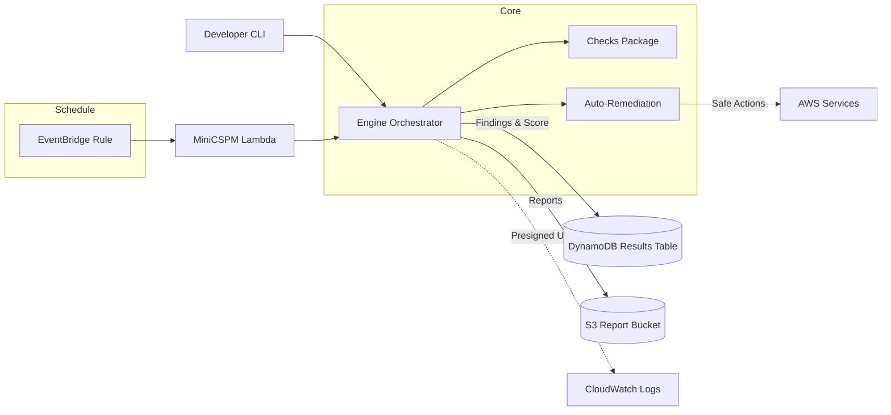

# MiniCSPM

## 소개
MiniCSPM은 AWS 계정을 대상으로 CIS AWS Foundations Benchmark v1.5의 핵심 10개 통제를 지속적으로 점검하기 위한 경량 CSPM 파이프라인입니다. 구성 요소는 다음과 같습니다.
- **Checks**: `checks/` 폴더에 위치하며 각 CIS 통제를 코드로 정의합니다.
- **Engine**: `infra/sam-app/src/engine.py`가 점검 실행, 점수 산출, 레포트 저장, (선택) 자동시정을 담당합니다.
- **Delivery Surfaces**: AWS Lambda(SAM 템플릿)와 개발자용 CLI(`python -m minicspm.cli`)를 제공하며, 결과는 DynamoDB와 S3(CSV/HTML/PDF)로 전달됩니다.

데이터 흐름은 다음과 같이 흘러갑니다: 클라이언트가 엔진을 호출하면 AWS SDK를 통해 메타데이터를 수집 → 검사 모듈이 Findings를 생성 → 엔진이 점수/요약을 계산 → DynamoDB에 저장하고 S3에 CSV(+HTML/PDF) 보고서를 업로드 → (선택) Auto-Remediation이 경고 증거에 기록됩니다.

## 빠른 시작
1. Python 3.11 가상환경을 준비하고 의존성을 설치합니다.
   ```bash
   python3.11 -m venv .venv && source .venv/bin/activate
   pip install -r requirements.txt
   cp .env.example .env
   ```
2. 로컬 환경변수를 불러오고 CLI로 스캔을 실행합니다.
   ```bash
   export $(grep -v '^#' .env | xargs)
   python -m minicspm.cli scan --format csv --out out/mini-cspm.csv
   ```
   - 선택 실행: `python -m minicspm.cli scan --includes "CIS-1.1,CIS-4.1"`
3. 결과 확인:
   - `out/mini-cspm.csv`에 10개 통제의 PASS/FAIL/WARN 내역이 저장됩니다.
   - JSON 보고서가 필요하다면 `--format json --out out/mini-cspm.json`을 사용합니다.

## 설정 및 권한
환경 변수는 `.env.example`를 복사해 관리합니다. 주요 키:
- `TABLE_NAME`, `REPORT_BUCKET`: DynamoDB/S3 리소스 이름.
- `AUTO_REMEDIATE`: 0=Off, 1=Dry-run, 2=Safe apply.
- `ENABLE_HTML`/`ENABLE_PDF`: 추가 보고서 활성화 토글.
- `SCORE_THRESHOLD`: 가중 점수 하한(기본 80). 미만이면 경보 이벤트 발생.
- `EVENT_BUS_NAME`: EventBridge 커스텀 버스 이름(미설정 시 알림 비활성).
- `EVENT_SOURCE`/`EVENT_DETAIL_TYPE`: 커스텀 이벤트 메타데이터.
- `AUTO_REMEDIATE_APPLY`: `true`일 때만 안전 자동시정 적용을 허용(SSM 토글과 함께 필요).
- `REMEDIATION_APPLY_PARAMETER`: SSM Parameter Store 토글 이름(값이 `true`/`on` 등일 때만 적용 실행).

필수 권한은 최소권한 원칙으로 아래 표를 참고하세요.

| Service      | Required Actions |
|--------------|------------------|
| IAM          | `GetAccountSummary`, `ListUsers`, `ListMFADevices`, `GetAccountPasswordPolicy`, `ListAttachedUserPolicies`, `ListVirtualMFADevices` |
| CloudTrail   | `DescribeTrails`, `GetTrailStatus`, `GetEventSelectors`, `UpdateTrail`* |
| CloudWatch Logs/Alarms | `DescribeMetricFilters`, `PutMetricFilter`, `cloudwatch:PutMetricAlarm` |
| EC2          | `DescribeSecurityGroups`, `RevokeSecurityGroupIngress` |
| S3 Control   | `GetPublicAccessBlock`, `PutPublicAccessBlock` |
| S3           | `PutObject` (보고서 업로드 용도) |
| DynamoDB     | `PutItem`, `UpdateItem`, `Query`, `GetItem` |
| STS          | `GetCallerIdentity` |


\* `UpdateTrail`은 자동시정(AUTO_REMEDIATE=2)에서 CloudTrail 구성을 조정할 때만 필요하며, 적용 전에는 IAM 정책에서 제거해도 됩니다.

## 아키텍처


## 운영 가이드
- **스케줄 관리**: 기본 EventBridge `rate(24 hours)` 구성을 `SAM template.yaml`의 `ScheduleExpression` 파라미터로 조정합니다.
- **로그 모니터링**: CloudWatch Logs의 `MiniCSPMFunction` 로그 그룹에서 요약 출력과 오류 스택을 확인하고, 필터/알람을 설정하여 FAIL 증가를 감지하세요.
- **장애 복구 3단계**:
  1. 실패한 실행의 DynamoDB 항목을 조회하여 오류 메시지와 presigned URL 상태를 확인합니다.
  2. Lambda DLQ 또는 CloudWatch 알람을 통해 AWS SDK 제한/자격 문제를 교정하고, 필요한 경우 `AUTO_REMEDIATE`를 0으로 되돌립니다.
  3. `python -m minicspm.cli scan`으로 수동 재실행 후 `sam deploy`를 통해 수정된 스택을 재배포합니다.
- **경보 연계**: `EVENT_BUS_NAME`을 설정하면 `FAIL_ON=HIGH` 조건과 무관하게 아래 상황에서 EventBridge 커스텀 이벤트를 발행합니다.
  - `HIGH` 심각도의 FAIL이 1개 이상 발견
  - 가중 점수(`weighted`)가 `SCORE_THRESHOLD` 미만
  해당 이벤트에 SNS, Slack Lambda 등을 구독시켜 보안팀 알림 채널과 연동할 수 있습니다.

## 보안 및 컴플라이언스
- **시크릿 금지**: AWS 자격 증명, 토큰, 키는 Git에 포함하지 말고 AWS SSO 또는 환경 변수/Secrets Manager를 활용하세요.
- **최소권한**: 위 권한 표를 기준으로 IAM 역할을 정의하고, 자동시정이 불필요한 환경에서는 관련 권한(`UpdateTrail`, `RevokeSecurityGroupIngress`, `PutPublicAccessBlock`)을 제외하세요.
- **감사 추적**: 모든 자동시정 결과는 Finding evidence에 기록되므로 Change Management에 첨부할 수 있습니다.
- **자동시정 2중 안전장치**: `AUTO_REMEDIATE_APPLY=true`와 SSM Parameter(`REMEDIATION_APPLY_PARAMETER`) 값이 모두 `true`여야 실제 변경이 수행되며, 둘 중 하나라도 해제되면 강제로 Dry-run 모드로 동작합니다.

## Makefile 명령 요약
- `make init` : 가상환경 생성 및 `requirements.txt` 설치.
- `make scan` : 현재 자격으로 스캔을 실행해 `out/minicspm-<account>-<timestamp>.csv` 생성. 실패 시 종료코드 2.
- `make deploy` : `sam build` + `sam deploy`를 실행(기본 `--guided`).
- `make destroy` : `sam delete`로 스택 제거.

## 라이선스 & 정책
- [LICENSE](LICENSE)
- [SECURITY.md](SECURITY.md)
- [CHANGELOG.md](CHANGELOG.md)
